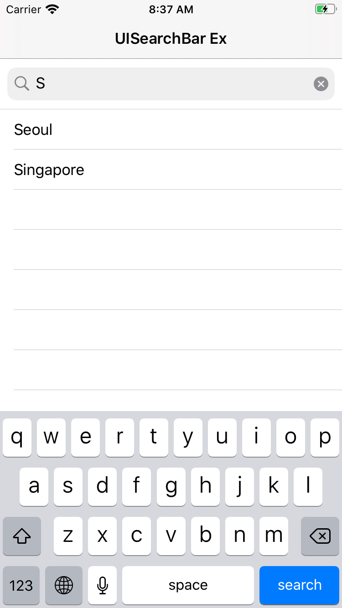

# Introduction

This project is created to show how to use a UISearchBar view. It is the same as the example of [this link](https://www.thedroidsonroids.com/blog/rxswift-by-examples-1-the-basics) except RxSwift is excluded and city names are added to the list.

---

# Description

This example demonstrates

* how to handle the text change event of a UISearchBar view
* how to update the contents of UITableView view when the text of UISearchBar view is changed
* filtering city names when the text of the search bar view is changed

---

# Screenshot

</img>

---

# Reference

* [RxSwift by Examples #1 – The Basics](https://www.thedroidsonroids.com/blog/rxswift-by-examples-1-the-basics)
* [예제로 시작하는 RxSwift #1 - 기초](https://pilgwon.github.io/blog/2017/09/26/RxSwift-By-Examples-1-The-Basics.html)
* [UISearchBar](https://developer.apple.com/documentation/uikit/uisearchbar)
